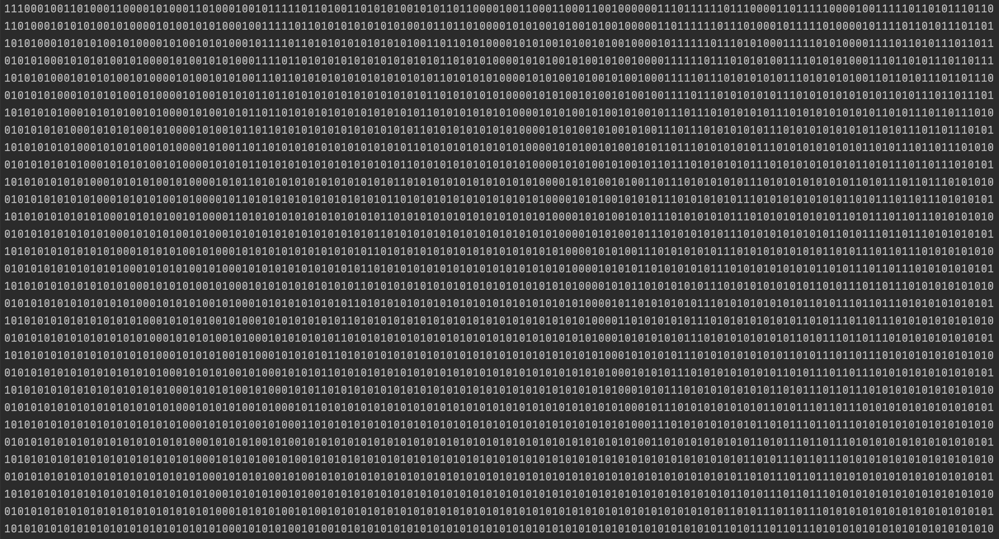

# Параллельный одномерный клеточный автомат Вольфрама

## Бенчмарки ускорения от кол-ва процессов:
<pre>
// настройки
#define WORLD_SIZE 1000000
#define MAX_ITERS 1000
#define RULE 110

$ mpirun -n 1 wolfram 
Time: 16.473927

$ mpirun -n 2 wolfram
Time: 8.534701

$ mpirun -n 3 wolfram
Time: 6.099497

$ mpirun -n 4 wolfram
Time: 4.690675
</pre>

## Эволюция для "знаменитых" правил:

### Rule 90
> 

### Rule 110
> 

### Rule 184
> 
